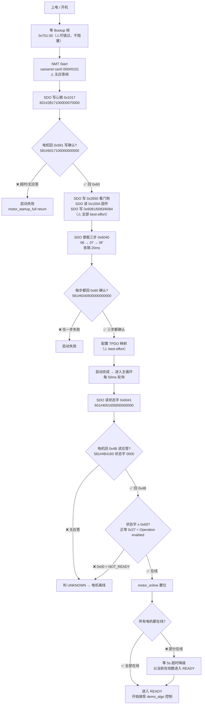

## 程序启动控制指令与返回流程图

> ✅ = 电机必须应答；⚠️ = best-effort（无应答/失败不阻塞主流程）。

## 关键应答要求

| 环节 | 程序下发 | 电机必须返回 | 不返回的后果 |
|------|---------|-------------|-------------|
| 写心跳 0x1017 | `601#2B171000D0070000` | `581#6017100000000000`（0x60 写确认） | 启动直接失败 |
| 使能 06/07/0F | `601#2B40600006000000` 等 | 每步 `581#6040600000000000`（0x60） | 启动直接失败 |
| 读状态字 0x6041 | `601#4001600000000000` | `581#4B4160<状态字小端>0000`（0x4B 读应答） | 判离线，不进 READY |
| 状态字值 | — | ≥ `0x60`（正常 `0x27`） | `0x00` 判 NOT_READY，同样离线 |

## 一句话总结

电机在「写参数时回 `0x60`、读状态字时回 `0x4B` + 状态字 `0x27`」这两点上做到，
程序就能从开机一路走到 READY 并接受 demo_algo 控制。
