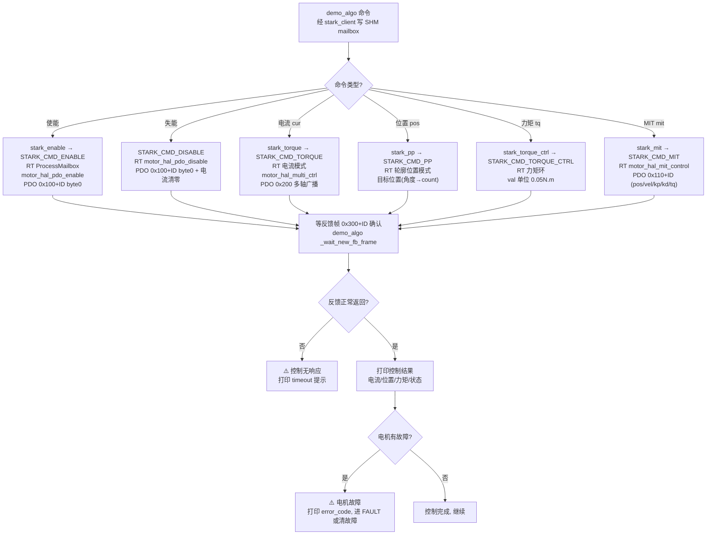

# 外骨骼 stark_periph_manager_node 框架运行流程图

> **draw.io 导入**：打开 [draw.io](https://app.diagrams.net) → 菜单 `Arrange → Insert → Advanced → Mermaid` → 粘贴 ```mermaid 代码块 → 生成图 → `File → Export` 或复制粘贴到 Word。
>
> **图例**：
> - 菱形 `{}` = 判断；失败走 `否` 分支，落到红色失败提示节点（⚠️）。
> - 每个步骤标注 **调用的函数** 和 **CAN 指令**（SDO/PDO/NMT + COB-ID）。
> - 「失败不中断」步骤：失败只打日志跳过，不影响流程。

---

## 图 1：初始化 + 校准流程（合并）

```mermaid
flowchart TD
    A["进程启动 main()"] --> B["InitDispatcher()<br/>读配置 LoadMotorConfig<br/>CANFD建链 motor_hal_create/init<br/>注册电机 motor_hal_add_motor<br/>启动接收线程 motor_hal_recv_start<br/>打开SHM + 初始化IMU/足压"]
    B --> C{"初始化成功?"}
    C -->|"否"| F0["⚠️ 节点启动失败, 退出"]
    C -->|"是"| D["进入 BOOTING 状态"]
    D --> E["主循环 poll_common<br/>process_pending_startups<br/>执行电机启动序列 motor_startup_full"]
    E --> E1["1. 等 Bootup 帧<br/>CAN: 0x700+ID data=0<br/>函数: motor_startup_wait_bootup<br/>500ms 试探, 收不到也不失败"]
    E1 --> E2["2. NMT Start<br/>CAN: 0x000 cmd=0x01<br/>函数: canopen_nmt_build + can_driver_send<br/>切 Operational, 不检查响应"]
    E2 --> E3["3. SDO 写心跳周期<br/>CAN: 0x600+ID 写 0x1017=heartbeat_ms<br/>函数: sdo_write_simple"]
    E3 --> E3J{"SDO 应答成功?"}
    E3J -->|"否"| F1["⚠️ 电机初始化失败<br/>startup 返回错误, 电机保持 NOT_READY 不上线"]
    E3J -->|"是"| E4["4. SDO 关看门狗 0x2650=1<br/>失败不中断"]
    E4 --> E5["5. SDO 读固件版本 0x100A<br/>失败仅打印, 不中断"]
    E5 --> E6["6. SDO 运动参数<br/>0x6081速度/0x6083加速/0x6084减速<br/>失败不中断"]
    E6 --> E7J{"配置 auto_enable?"}
    E7J -->|"否"| E8
    E7J -->|"是"| E7["7. DS402 使能 motor_startup_enable<br/>0x6040=0x0006→0x0007→0x000F<br/>延时120ms 等抱闸"]
    E7 --> E7J2{"使能成功?"}
    E7J2 -->|"否"| F2["⚠️ 电机初始化失败"]
    E7J2 -->|"是"| E8["8. TPDO 同步上报配置<br/>写 0x1800/0x1A00 映射<br/>Statusword+Position+Velocity+Current<br/>失败不中断"]
    E8 --> G["update_shm_online<br/>读电机 state 检测在线掩码"]
    G --> H{"所有电机在线?"}
    H -->|"否"| H1["等待 / 5秒超时降级<br/>打WARN: 部分电机在线"]
    H1 --> H2["READY 状态(降级)"]
    H -->|"是"| I["READY 状态"]
    H2 --> J
    I --> J["启动 RT 线程(1kHz SCHED_FIFO)<br/>启动 SYNC 线程 + SDO telemetry"]
    J --> K["等待校准触发<br/>按键长按 calib_requested"]
    K --> L["校准 motor_calib_start<br/>Step1: SDO 写 0x6040=0x0006 停机<br/>函数: motor_hal_sdo_write"]
    L --> L1J{"停机成功?"}
    L1J -->|"否"| F3["⚠️ 校准失败"]
    L1J -->|"是"| M["Step2: 设零位<br/>函数: motor_hal_set_zero"]
    M --> M1J{"设零位成功?"}
    M1J -->|"否"| F4["⚠️ 校准失败"]
    M1J -->|"是"| N["进入 CHECKING 轮询 motor_calib_poll"]
    N --> O{"反馈可用且位置在±阈值内?<br/>angle=position×180/32768"}
    O -->|"否"| O1{"超时? timeout_ms"}
    O1 -->|"是"| F5["⚠️ 校准超时失败 TIMEOUT"]
    O1 -->|"否"| N
    O -->|"是"| P["力矩零漂标定 motor_hal_torque_calib<br/>失败跳过, 不中断"]
    P --> Q["设置控制模式 motor_hal_set_mode<br/>(使能前切模式)"]
    Q --> Q1J{"模式设置成功?"}
    Q1J -->|"否"| F6["⚠️ 校准失败 FAILED"]
    Q1J -->|"是"| R["DS402 使能<br/>0x6040=0x06→0x07→0x0F"]
    R --> R1J{"使能成功?"}
    R1J -->|"否"| F7["⚠️ 校准超时失败 TIMEOUT"]
    R1J -->|"是"| S["启动传感器透传 motor_hal_sensor_config<br/>period_div=4 最快周期"]
    S --> T["校准完成 DONE"]
    T --> U["state_transition(STATE_RUNNING)<br/>RT 1kHz 控制循环激活"]
```



---

## 图 2：控制流程（使能/失能/电流/位置/力矩/MIT）



---

## 附录：CAN 帧 COB-ID 速查表

| COB-ID | 类型 | 方向 | 用途 |
|--------|------|------|------|
| 0x000 | NMT | 主机→电机 | Start(0x01)/Stop/Reset |
| 0x080 | SYNC | 主机→电机 | 同步报文 |
| 0x080+ID | EMCY | 电机→主机 | 紧急报文(故障) |
| 0x600+ID | SDO 请求 | 主机→电机 | 读/写对象字典 |
| 0x580+ID | SDO 应答 | 电机→主机 | SDO 响应 |
| 0x700+ID | Bootup/Heartbeat | 电机→主机 | 上线(data=0)/心跳 |
| 0x100+ID | 自定义 PDO | 主机→电机 | 单轴实时控制(7B) |
| 0x110+ID | MIT PDO | 主机→电机 | MIT 阻抗控制(9B) |
| 0x200 | 多轴广播 | 主机→电机 | 多轴控制(64B) |
| 0x210 | MIT 多轴 | 主机→电机 | MIT 多轴(64B) |
| 0x300+ID | 反馈帧 | 电机→主机 | 位置/速度/电流/力矩(12B) |

### 关键对象字典（OD）

| OD | 含义 | 用法 |
|----|------|------|
| 0x1017 | 心跳周期 | SDO 写 heartbeat_ms，验证在线 |
| 0x2650 | 看门狗/限位 | SDO 写 1 关看门狗 |
| 0x100A | 固件版本 | SDO 读，验证链路 |
| 0x6040 | Controlword | 0x06/0x07/0x0F 使能 |
| 0x6041 | Statusword | 状态反馈 |
| 0x6081/0x6083/0x6084 | 速度/加速度/减速度 | 轮廓运动参数 |
| 0x1800/0x1A00 | TPDO 配置/映射 | 同步上报配置 |

### 失败汇总

| 环节 | 失败条件 | 失败结果 |
|------|---------|---------|
| 电机初始化 | SDO 写心跳 0x1017 超时/错误 | startup 失败, 电机保持 NOT_READY 不上线 |
| 电机初始化 | DS402 使能(0x06/07/0F)任一步失败 | startup 失败 |
| 校准 | 停机 0x6040=06 失败 | 校准失败 |
| 校准 | 设零位失败 | 校准失败 |
| 校准 | 位置超时未入阈值 | 校准超时 TIMEOUT |
| 校准 | 模式设置失败 | 校准失败 FAILED |
| 校准 | 使能失败 | 校准超时 TIMEOUT |
