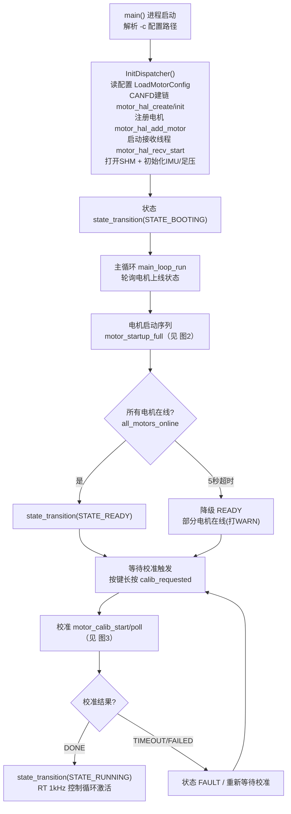
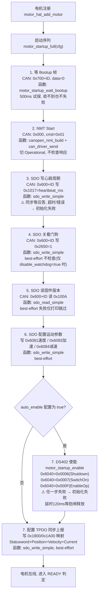
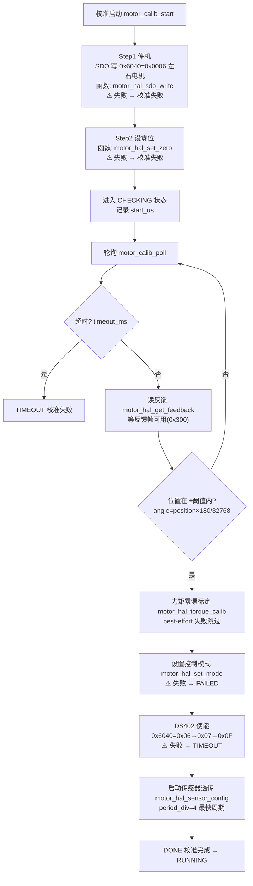
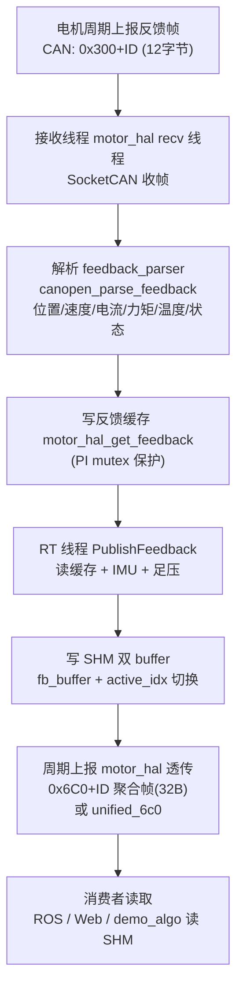
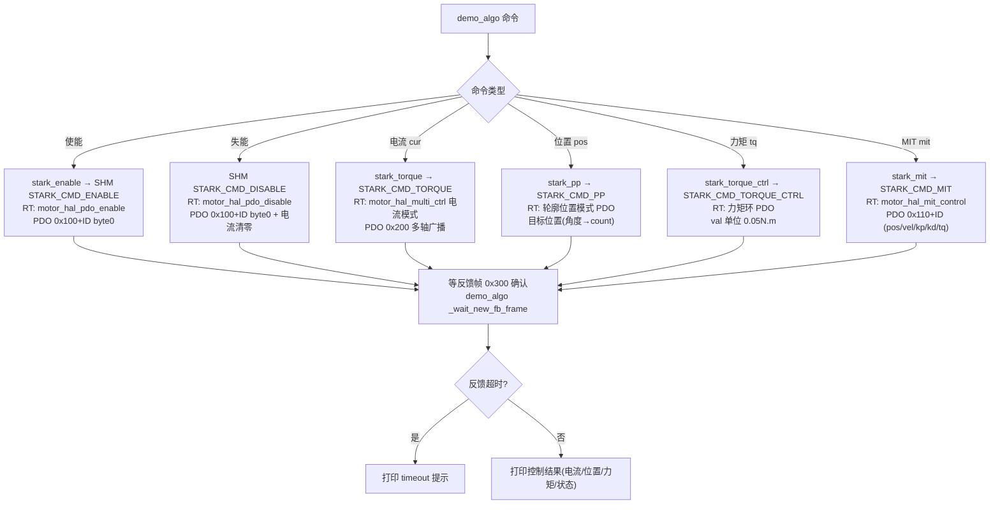

# 外骨骼 stark_periph_manager_node 框架运行流程图

> **怎么用（draw.io 导入）**：打开 [draw.io](https://app.diagrams.net) → 菜单 `Arrange → Insert → Advanced → Mermaid` → 粘贴下面任意一个 ```mermaid 代码块 → 生成图 → `File → Export` 或直接复制粘贴到 Word。
>
> **说明**：
> - 每个流程节点里标注了 **调用的函数** 和 **下发的 CAN 指令**（SDO/PDO/NMT + COB-ID + 数据）。
> - ⚠️ 标记 = 该指令失败（返回错误 / 超时不响应）会导致**初始化/流程失败**；无标记 = best-effort，失败只打日志跳过。

---

## 图 1：进程启动 → 等上线 → 校准 → 运行（总览）



---

## 图 2：电机启动初始化序列（motor_startup_full，逐个 CAN 指令）

> 这是"初始化下发了哪些 CAN 指令"的核心。函数实现在 `motor_hal_startup.c`。



---

## 图 3：校准流程（motor_calib）



---

## 图 4：数据上报流程



---

## 图 5：控制流程（demo_algo 命令 → RT 下发 PDO/SDO）

> demo_algo 命令经 `stark_client`（写 SHM mailbox）→ RT 线程 `ProcessMailbox` → PDO/SDO 下发。



---

## 附录：CAN 帧 COB-ID 速查表

| COB-ID | 类型 | 方向 | 用途 |
|--------|------|------|------|
| 0x000 | NMT | 主机→电机 | Start(0x01)/Stop/Reset |
| 0x080 | SYNC | 主机→电机 | 同步报文 |
| 0x080+ID | EMCY | 电机→主机 | 紧急报文(故障) |
| 0x600+ID | SDO 请求 | 主机→电机 | 读/写对象字典 |
| 0x580+ID | SDO 应答 | 电机→主机 | SDO 响应 |
| 0x700+ID | Bootup/Heartbeat | 电机→主机 | 上线(data=0)/心跳 |
| 0x100+ID | 自定义 PDO | 主机→电机 | 单轴实时控制(7B) |
| 0x110+ID | MIT PDO | 主机→电机 | MIT 阻抗控制(9B) |
| 0x200 | 多轴广播 | 主机→电机 | 多轴控制(64B) |
| 0x210 | MIT 多轴 | 主机→电机 | MIT 多轴(64B) |
| 0x300+ID | 反馈帧 | 电机→主机 | 位置/速度/电流/力矩(12B) |

### 关键对象字典（OD）

| OD | 含义 | 初始化用法 |
|----|------|-----------|
| 0x1017 | 心跳周期 | SDO 写 heartbeat_ms，验证在线 |
| 0x2650 | 看门狗/限位 | SDO 写 1 关看门狗 |
| 0x100A | 固件版本 | SDO 读，验证链路 |
| 0x6040 | Controlword | 0x06/0x07/0x0F 使能 |
| 0x6041 | Statusword | 状态反馈 |
| 0x6081/0x6083/0x6084 | 速度/加速度/减速度 | 轮廓运动参数 |
| 0x1800/0x1A00 | TPDO 配置/映射 | 同步上报配置 |
